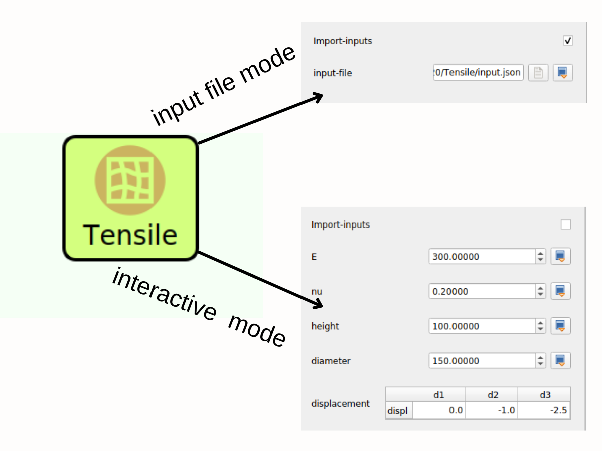

# Fenics-Tensile

This WaNo uses the Finite Element Fenics library to compute the tensile properties of a cylindric body.

# Python dependencies

```
- python==3.9
- fenics==2019.1.0
- mshr==2019.1.0
- pyymal
```

# Create a conda environment:
```
conda create -n fenicsproject python=3.9 numpy fenics==2019.1.0 mshr==2019.1.0 pyyaml
```

Alternatively, you can run the script locally by executing the command below in the same folder where you saved the input (input.json). 

```
python tensile.py
```

# Usage in SimStack

For this particular WaNo, as shown in the figure below, you can run it in the mode, where you insert the parameter interactively via the SimStack GUI or by loading the inputs from a given '.json' file.



**Fig 1** This WaNo allows the inputs to come from ` .json` files or by changing the exposed parameter values in the GUI.

